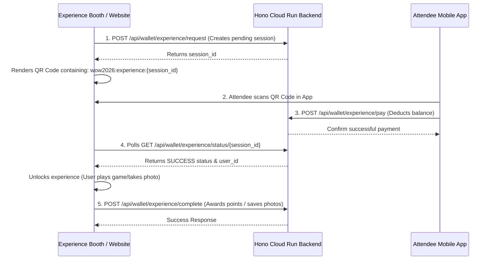

# WOW 2025 Event Experiences Integration API Documentation

This document describes the API endpoints and integration workflow for event experiences (such as the Photo Booth and Arcade games) using the WOW e-wallet system. 

**Base URL:**
`https://now-in-google-backend-1010379975924.asia-south1.run.app/nowingoogle-backend`

> [!IMPORTANT]
> **API Version Header:**
> All requests to the backend endpoints (except local dev origins) MUST include the following header to bypass global security restriction rules:
> `x-api-version: 2.0.0`

---

## Workflow Overview



---

## API Endpoints

### 1. Create Experience Payment Request
Generates a payment request session for a specific experience. Call this from the booth screen/website to generate the session.

* **Endpoint:** `POST /api/wallet/experience/request`
* **Auth:** None (Public)
* **Headers:**
  ```http
  Content-Type: application/json
  x-api-version: 2.0.0
  ```
* **Request Body:**
  ```json
  {
    "experience_id": "photo_booth_premium",
    "name": "Premium Photo Booth",
    "amount": 50.0
  }
  ```
* **Response Body (200 OK):**
  ```json
  {
    "status": true,
    "message": "Experience payment request session created",
    "session_id": "clx_session_12345abcde"
  }
  ```

> [!IMPORTANT]
> **QR Code Formatting:**
> Render the `session_id` returned in the response as a QR code containing the string prefix exactly formatted as:
> `wow2026:experience:clx_session_12345abcde`

---

### 2. Poll Payment Status
Allows the experience website/booth to poll the status of the session to check if the attendee scanned and authorized the payment.

* **Endpoint:** `GET /api/wallet/experience/status/:session_id`
* **Auth:** None (Public)
* **Headers:**
  ```http
  x-api-version: 2.0.0
  ```
* **Response Body (200 OK):**
  * *When payment is still pending:*
    ```json
    {
      "status": true,
      "data": {
        "id": "clx_session_12345abcde",
        "experience_id": "photo_booth_premium",
        "name": "Premium Photo Booth",
        "amount": 50.0,
        "session_status": "PENDING",
        "user_id": null,
        "photo_urls": []
      }
    }
    ```
  * *When paid successfully:*
    ```json
    {
      "status": true,
      "data": {
        "id": "clx_session_12345abcde",
        "experience_id": "photo_booth_premium",
        "name": "Premium Photo Booth",
        "amount": 50.0,
        "session_status": "SUCCESS",
        "user_id": "user_firebase_uid_999",
        "photo_urls": []
      }
    }
    ```

---

### 3. Authorize/Pay Session (Mobile App)
Called by the attendee's mobile app after scanning the QR code to deduct WOW Cash and approve payment.

* **Endpoint:** `POST /api/wallet/experience/pay`
* **Auth:** Bearer Token (Authenticated user)
* **Headers:**
  ```http
  Authorization: Bearer <attendee_firebase_id_token>
  Content-Type: application/json
  x-api-version: 2.0.0
  ```
* **Request Body:**
  ```json
  {
    "session_id": "clx_session_12345abcde"
  }
  ```
* **Response Body (200 OK):**
  ```json
  {
    "status": true,
    "message": "Experience payment successful",
    "data": {
      "balance": 250.0,
      "transaction": {
        "id": "tx_debit_998877",
        "wallet_id": "user_firebase_uid_999",
        "amount": 50.0,
        "type": "DEBIT",
        "status": "SUCCESS",
        "description": "Paid for Premium Photo Booth experience",
        "reference": "clx_session_12345abcde",
        "createdAt": "2026-07-03T02:45:00.000Z"
      },
      "session": {
        "id": "clx_session_12345abcde",
        "experience_id": "photo_booth_premium",
        "name": "Premium Photo Booth",
        "amount": 50.0,
        "status": "SUCCESS",
        "user_id": "user_firebase_uid_999",
        "photo_urls": []
      }
    }
  }
  ```

---

### 4. Complete Experience
Call this endpoint once the user finishes playing the game or taking photos to award points or submit files.

* **Endpoint:** `POST /api/wallet/experience/complete`
* **Auth:** None (Public)
* **Headers:**
  ```http
  Content-Type: application/json
  x-api-version: 2.0.0
  ```
* **Request Body:**
  * **Option A: For Arcade / Game Experiences (Awards Points):**
    ```json
    {
      "session_id": "clx_session_12345abcde",
      "points": 150
    }
    ```
  * **Option B: For Photo Booth Experiences (Uploads Photos as Byte Arrays):**
    ```json
    {
      "session_id": "clx_session_12345abcde",
      "images": [
        [137, 80, 78, 71, 13, 10, 26, 10, 0, 0, 0, 13, 73, 72, 68, 82, 0, 0], 
        [137, 80, 78, 71, 13, 10, 26, 10, 0, 0, 0, 13, 73, 72, 68, 82, 0, 0]
      ]
    }
    ```

* **Response Body (200 OK):**
  ```json
  {
    "status": true,
    "message": "Experience completed successfully",
    "photo_urls": [
      "https://<r2-endpoint>/wow-photobooth/photobooth/user_firebase_uid_999/1719945900000_0.jpg",
      "https://<r2-endpoint>/wow-photobooth/photobooth/user_firebase_uid_999/1719945900000_1.jpg"
    ]
  }
  ```

> [!NOTE]
> * For **Photo Booth** experiences (where `experience_id` contains `photo_booth` or `photobooth`), the backend automatically converts each byte array (number array) to a binary buffer and uploads it directly to Cloudflare R2 storage under `photobooth/{user_id}/{timestamp}_{index}.jpg`.
> * For **other** experiences, it credits the `points` amount to the user's `wow_score` and synchronizes the leaderboard real-time.
